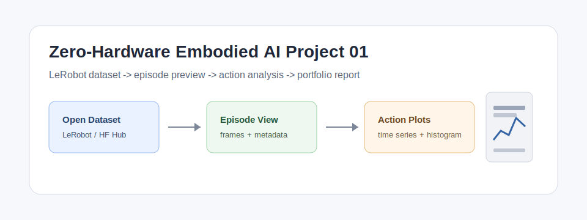
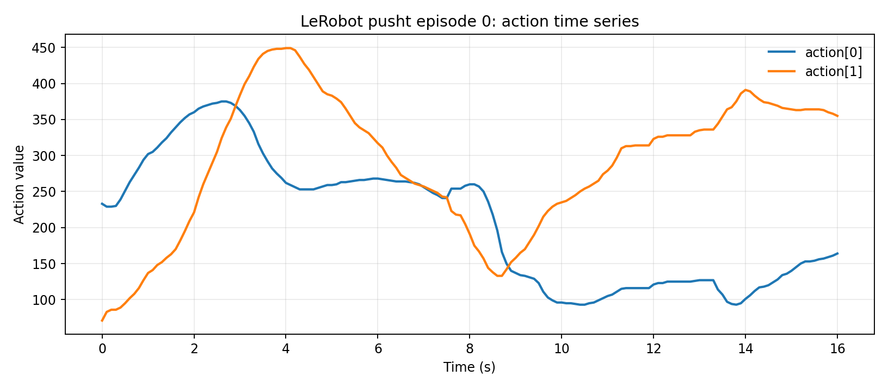
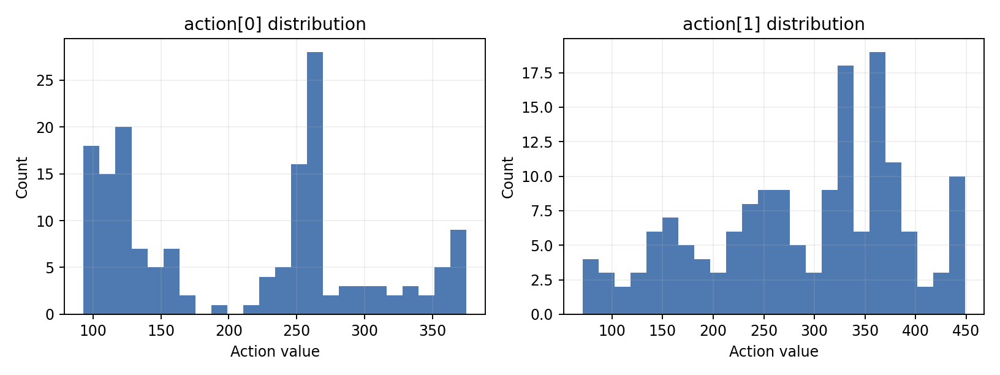

# Zero-Hardware Embodied AI Project 01

[](https://colab.research.google.com/github/Qinghev/zero-hardware-embodied-ai/blob/main/notebooks/colab_quick_start.ipynb)

不用真实机器人，也能跑通第一个具身智能项目。

这个免费版仓库聚焦一个足够小、足够可展示的项目：用 LeRobot 数据集完成 episode 读取、图像帧抽样、action 时序与分布可视化，并生成可放进作品集的基础结果。

> 产品定位：不是 LeRobot 教程，而是“零硬件具身智能求职项目包”的免费样例。



## Demo 输出

下面三张图来自 `lerobot/pusht` 数据集的 episode 0。






## 你会做出什么

- 加载一个公开 LeRobot 数据集
- 抽取指定 episode 的 observation/action
- 保存 episode 首帧预览
- 绘制 action time series
- 绘制 action distribution
- 生成基础 JSON 摘要

## 适合谁

- 会 Python，想入门 robot learning / embodied AI / VLA
- 想准备机器人、AI、具身智能相关实习或作品集
- 暂时没有机械臂、相机、遥操作设备等硬件
- 想先理解 episode、observation、action 和数据质量

## 不适合谁

- 完全不会配置 Python 环境
- 只想看科普，不想跑代码
- 想直接控制真实机器人
- 需要一对一环境调试

## Colab Quick Start

最省事的方式是直接打开 Colab：

[打开 Colab 一键运行](https://colab.research.google.com/github/Qinghev/zero-hardware-embodied-ai/blob/main/notebooks/colab_quick_start.ipynb)

项目 01 不需要 GPU。Colab 里建议选择：

```text
Runtime -> Change runtime type -> Hardware accelerator: None
```

## Local Quick Start

推荐使用 conda/miniforge。这个仓库的免费版固定使用 `lerobot==0.4.4`，Python 版本要求为 3.10+；本仓库默认给出 Python 3.11 环境。

```bash
conda env create -f environment.yml
conda activate zero-embodied
python check_env.py
python scripts/download_dataset.py --repo-id lerobot/pusht
python scripts/visualize_episode_basic.py --repo-id lerobot/pusht --episode-index 0
```

输出文件会写入：

```text
assets/
  episode_0_first_frame.png
  episode_0_action_timeseries.png
  episode_0_action_distribution.png
reports/
  episode_0_basic_summary.json
```

## 免费版 vs 完整版

免费版包含：

- 环境自检
- 数据集下载脚本
- 基础 episode/action 可视化
- 最小 quick start notebook
- 入门文档

完整版计划包含：

- 完整 notebook
- 数据质量检查
- 轨迹异常检测
- 自动 HTML 报告生成器
- 中文详细教程
- 常见错误 FAQ
- 项目报告模板
- GitHub README 模板
- 中文/英文简历描述
- 面试讲解稿和追问清单

## 安全边界

这个项目只做本地数据集分析与可视化，不启动 policy server，不开放网络服务，不控制真实机器人，也不要求运行来源不明的 pickle/model 文件。

## 当前状态

- `v0.1`: 免费版仓库骨架与最小可运行脚本
- 下一步：加入 Colab notebook、demo GIF、付费版报告模板
